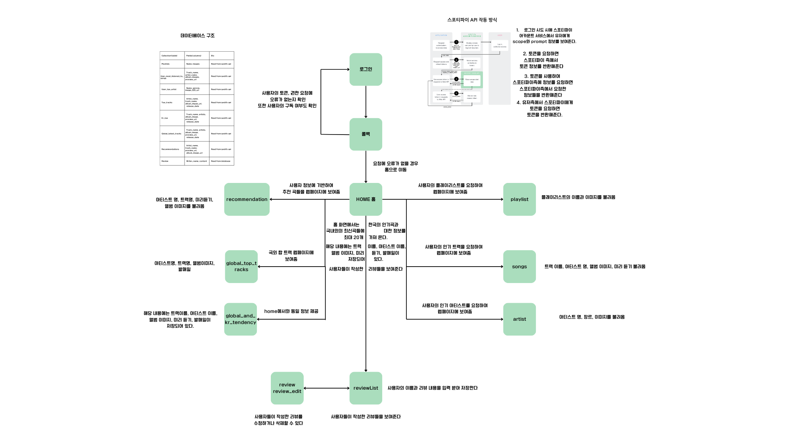
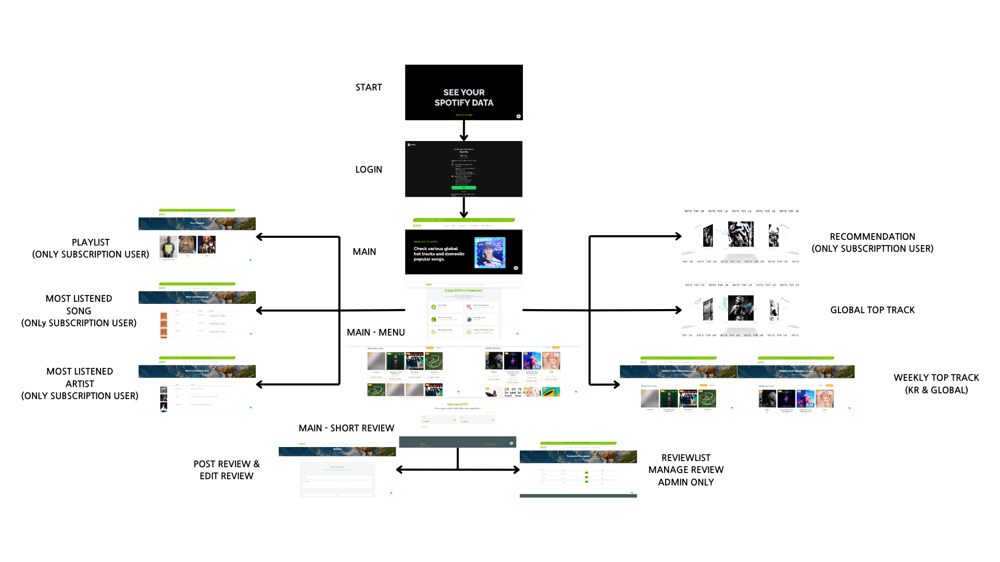
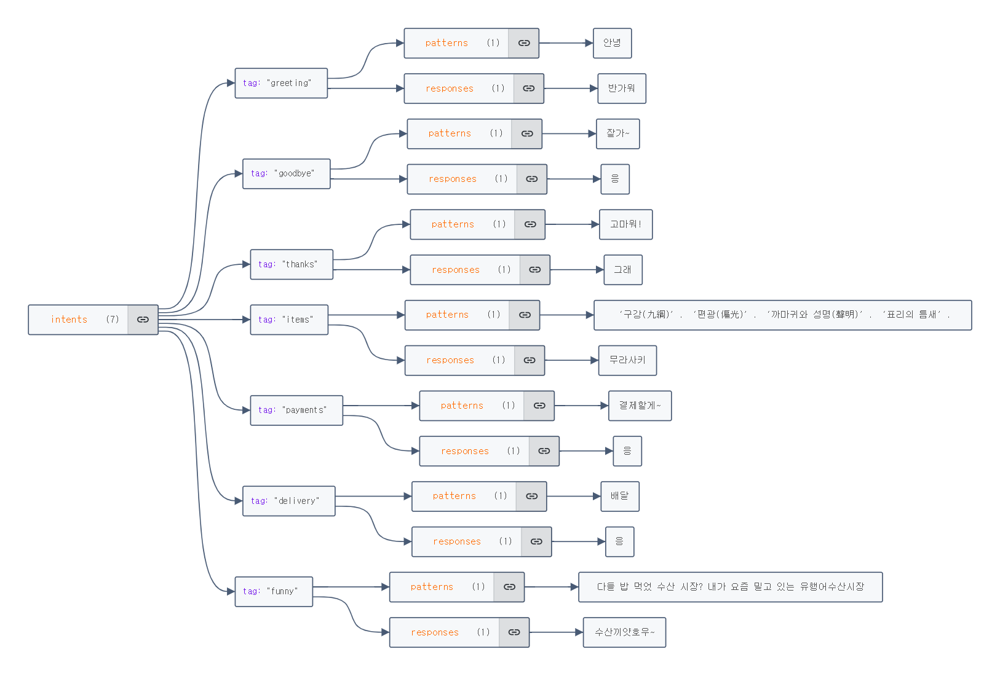
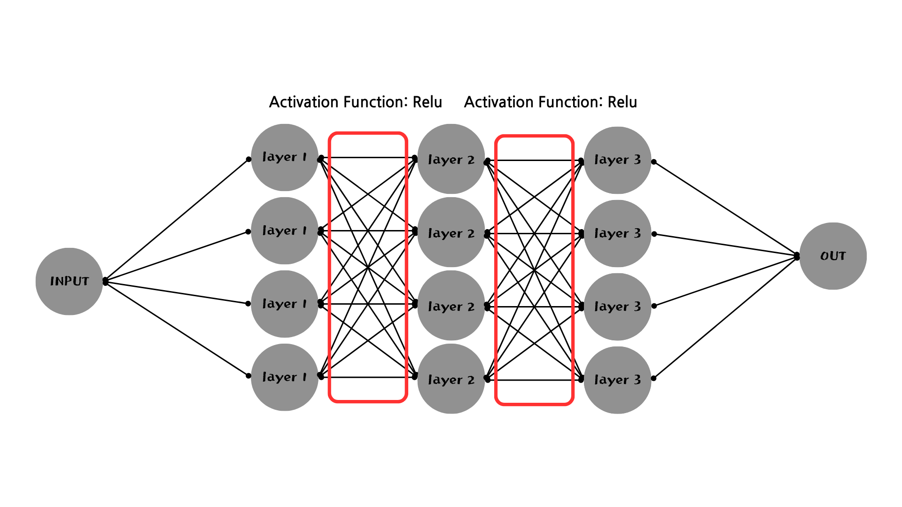

# 인공지능 기반 음악 추천 웹 서비스 설계서
(AI Based Music Recommendation Web Service Design Document)

## 프로젝트명
SOTP (SHOUT OUT TO SPOTIFY)

## 작성일자
2024/05/27

## 팀 명
GOAT

## Contents
1. [Overview](#overview)
 
   1.1 [Purpose](#purpose)
 
   1.2 [Scope](#scope)

2. [Architectural Design](#architectural-design)
 
   2.1 [Data Flow Diagram](#data-flow-diagram)
 
   2.2 [Tech](#tech)

   &nbsp;&nbsp;&nbsp;&nbsp;&nbsp;&nbsp;&nbsp;&nbsp;2.2.1 [Spotify](#spotify)

   &nbsp;&nbsp;&nbsp;&nbsp;&nbsp;&nbsp;&nbsp;&nbsp;2.2.2 [Backend](#backend)

   &nbsp;&nbsp;&nbsp;&nbsp;&nbsp;&nbsp;&nbsp;&nbsp;2.2.3 [Frontend](#frontend)

3. [Recommend System](#recommend-system)

    3.1 [Introduction to Traditional Recommendation Algorithms](#introduction-to-traditional-recommendation-algorithms)

    &nbsp;&nbsp;&nbsp;&nbsp;&nbsp;&nbsp;&nbsp;&nbsp;3.1.1 [Collaborative Filtering- User-Based Collaborative Filtering](#collaborative-filtering--user-based-collaborative-filtering)

    &nbsp;&nbsp;&nbsp;&nbsp;&nbsp;&nbsp;&nbsp;&nbsp;3.1.2 [Collaborative Filtering- Item-Based Collaborative Filtering](#collaborative-filtering--item-based-collaborative-filtering)

    &nbsp;&nbsp;&nbsp;&nbsp;&nbsp;&nbsp;&nbsp;&nbsp;3.1.3 [Content-Based Filtering](#content-based-filtering)

    3.2 [Introduction to the Used Recommendation Algorithm](#introduction-to-the-used-recommendation-algorithm)

    &nbsp;&nbsp;&nbsp;&nbsp;&nbsp;&nbsp;&nbsp;&nbsp; 3.2.1 [Multi-Armed-Bandit(MAB)](#multi-armed-bandit-mab)
 
   3.3 [Reasons for Choosing the Algorithm](#reasons-for-choosing-the-algorithm)

    &nbsp;&nbsp;&nbsp;&nbsp;&nbsp;&nbsp;&nbsp;&nbsp;  3.3.1 [Cold Start Problem](#cold-start-problem)

      &nbsp;&nbsp;&nbsp;&nbsp;&nbsp;&nbsp;&nbsp;&nbsp;3.3.2 [Reflecting Changes in User Preferences](#reflecting-changes-in-user-preferences)

      &nbsp;&nbsp;&nbsp;&nbsp;&nbsp;&nbsp;&nbsp;&nbsp;3.3.3 [Algorithm Utilization by Spotify](#algorithm-utilization-by-spotify)

4. [Chat-bot](#chat-bot)

5. [Reference](#reference)

## 1. Overview

### 1.1 Purpose
&nbsp;본 설계서의 목적은 제공하고자 하는 음악 추천 서비스가 어떠한 방식으로 설계되었고, 작동되는 것인지를 본 설계서의 독자가 이해하게 하기 위함에 있다. 본 시스템은 인공지능 기반의 음악 추천 시스템으로서 사용자의 보다 풍족한 문화 생활을 위해 제공된다.

### 1.2 Scope
&nbsp;본 웹 서비스 설계서는 API를 활용한 인공지능 기반의 음악 추천 서비스에 사용된 기술과 그 목적을 소개 / 설명하기 위해 작성되었다.

## 2. Architectural Design

### 2.1 Data Flow Diagram

### 2.2 Tech

#### 2.2.1 Spotify
| 함수명               | 기능                                                                                             | 비고                       |
|----------------------|--------------------------------------------------------------------------------------------------|----------------------------|
| Index                | 로그인 링크를 제공                                                                               |                            |
| Login                | Spotify API에 로그인하기 위한 인증 코드를 요청합니다. 사용자는 승인 후 애플리케이션으로 다시 리디렉션 |                            |
| Callback             | 로그인 후 Spotify에서 전달된 인증 코드를 받아 액세스 토큰을 요청하고 토큰을 세션에 저장          | 오류가 발생할 경우 사용자에게 표시될 페이지를 Index 함수로 이동시킴 |
| Verify_subscription  | 사용자가 spotify를 구독하고 있는지 확인                                                           | 구독하고 있지 않을 경우 별도의 페이지로 이동시킴 |
| Home_page            | 사용자의 액세스 토큰이 있는지 확인하고 만료되지 않았는지 확인한 후 메인 페이지를 렌더링           | 액세스 토큰을 확인 후 작동 |
| Get_playlist         | 사용자의 플레이리스트를 가져와 템플릿에 표시                                                      | 액세스 토큰을 확인 후 작동. 앨범 이미지가 존재하는지 확인. 플레이리스트의 존재여부를 확인 |
| Get_songs            | 사용자의 인기 트랙을 가져와 템플릿에 표시                                                        | 액세스 토큰을 확인 후 작동. 데이터베이스에 저장되어 있는 각 트랙의 정보를 추출. 데이터의 존재여부를 확인 |
| Get_artists          | 사용자의 인기 아티스트를 가져와 템플릿에 표시                                                    | 액세스 토큰을 확인 후 작동. 데이터의 존재여부를 확인 |
| Global_top_track     | 해외 인기 트랙을 가져와 템플릿에 표시                                                            | 액세스 토큰을 확인 후 작동. Spotify api에 해외 인기 트랙에 대한 http get 요청을 보냄. 데이터베이스와 대조하여 데이터 확인 |
| Global_and_kr_tendency | 국내의 인기 곡과 국내외의 신곡들을 가져와 템플릿에 표시                                       | 액세스 토큰을 확인 후 작동. 데이터 매주 갱신 |
| Recommendations      | 사용자의 인기 아티스트를 기반으로 추천 음악을 가져와 템플릿 표시                                | 액세스 토큰을 확인 후 작동. Spotify에서 제공하는 아티스트의 아이디를 기반으로 추천 제공 |
| Refresh-token        | 토큰의 만료 기간이 지났을 때 자동으로 토큰의 기간을 갱신                                        |                            |
| predict              | 패턴 기반의 챗봇(Chat-bot) 기능을 제공                                                          |                            |
| Review               | 사용자가 리뷰 작성을 할 수 있게 해주는 폼(form)창을 제공                                         |                            |
| reviewList           | 사용자들이 포스팅한 리뷰들을 한 번에 확인할 수 있는 기능을 제공                                 |                            |
| Review_edit          | 사용자들이 작성한 리뷰를 수정할 정보를 받는 폼(form)창을 제공                                   |                            |

#### 2.2.2 Backend

1. Spotify Session Flow Chart

2. Database Structure (MongoDB)

| Field(column)   | Data type   |
|-----------------|-------------|
| Name            | String      |
| Images          | Array – string |
| Track_name      | String      |
| Artist_name     | String      |
| Album_images    | Array – string |
| Preview_url     | String      |
| Genres          | String      |
| Image_320_url   | String      |
| Album_image_url | String      |
| Release_date    | string      |
| Writer_name     | String      |
| Content         | string      |

| Collection(table)              | Fields(columns)                | Etc                          |
|--------------------------------|--------------------------------|------------------------------|
| Playlists                      | Name, images                   | Read from spotify api        |
| User_most_listened_to_songs    | Track_name, artist_name, album_images, preview_url | Read from spotify api |
| User_top_artist                | Name, genres, image_320_url    | Read from spotify api        |
| Top_tracks                     | Artist_name, track_name, album_imgae_url, release_date | Read from spotify api |
| Kr_top                         | Track_name, artists, album_image, preview_url, release_date | Read from spotify api |
| Global_latest_tracks           | Track_name, artists, album_image, preview_url, release_date | Read from spotify api |
| Recommendations                | Artist_name, track_name, preview_url, album_image_url | Read from spotify api |
| Review                         | Writer_name, content           | Input from user              |

#### 2.2.3 Frontend

## 3. Recommend System

### 3.1 Introduction to Traditional Recommendation Algorithms

#### 3.1.1 Collaborative Filtering- User-Based Collaborative Filtering
&nbsp;해당 방식은 비슷한 취향을 가진 사용자들의 행동 데이터를 기반으로 추천을 제공한다.

먼저 사용자와 아이템 간의 상호작용 데이터(주로 리뷰)를 기반으로 사용자-아이템 평점 행렬을 생성한다. 

이 행렬은 각 사용자가 각 아이템에 대해 부여한 평점 또는 클릭 구매 등의 행동을 나타낸다. 

(계산의 편의를 위해 각 요소의 값은 임의로 설정하였다.)

|            | 상품1 | 상품2 | 상품3 | 상품4 |
|------------|-------|-------|-------|-------|
| 사용자 1   | 5     | 3     | 4     | ?     |
| 사용자 2   | 3     | 1     | 2     | 3     |
| 사용자 3   | 4     | 3     | 4     | 1     |
| 사용자 4   | 5     | 3     | 1     | 5     |
| 사용자 5   | 1     | 5     | 5     | 2     |

이러한 행렬이 존재할 경우 사용자 1의 상품4에 대한 선호도를 사용자 기반 협업 필터링이 계산하는 과정을 살펴보자.  

우선 사용자 1과 유사도가 높은, 즉 높은 관계성을 지닌 사용자 N명을 구해야 한다. 유사도를 계산할 경우 주로 코사인 유사도, 피어슨 상관 계수, 유클리디안 거리 등이 사용된다. 

해당 예시에서는 N = 2로 가정하고 사용자 3, 4가 사용자 1과 유사도가 높다고 보자. 평점 예측은 보통 가중 평균을 이용하여 구할 수 있다. 

사용자 3, 4의 상품 4에 대한 평점이 각각 1, 5이므로 그 평균은 3이 될 것이고, 만약 해당 수치가 알고리즘 내에서 미리 설정한 수치보다 클 경우 상품 4가 사용자 1에게 추천될 것이고, 반대의 경우 추천되지 않을 것이다.

### 3.1.2 Collaborative Filtering- Item-Based Collaborative Filtering
해당 방식은 1-1과는 다르게, 사용자 간이 아닌 아이템 간의 유사성을 기반으로 추천을 제공한다.

1-1과 동일하게 사용자-아이템 평점 행렬을 생성한다.

(계산의 편의를 위해 각 요소의 값은 임의로 설정하였다.)

|            | 상품1 | 상품2 | 상품3 | 상품4 |
|------------|-------|-------|-------|-------|
| 사용자 1   | 5     | 3     | 4     | ?     |
| 사용자 2   | 3     | 1     | 2     | 3     |
| 사용자 3   | 4     | 3     | 4     | 1     |
| 사용자 4   | 5     | 3     | 1     | 5     |
| 사용자 5   | 1     | 5     | 5     | 2     |

주체가 사용자에서 아이템으로 바뀌었을 뿐, 계산 방식에 차이는 거의 없다. 

상품 4에 대한 사용자 1의 평점을 예측하기 위해서는 1-1의 과정과 동일하게 상품 4와 높은 유사성을 갖는 상품 N를 구한 뒤 해당 상품의 사용자 1의 평점을 기준으로 가중 평균을 사용하여 값을 구해야 한다. 

동일하게 N=2라고 가정하고 상품 1, 2가 상품 4와 유사도가 높다고 보자. 상품 1, 2에 대한 사용자 1의 평점은 각각 5, 3이므로 이들의 가중 평균은 4이다. 

따라서 상품 4에 대한 사용자 1의 평점은 4로 예측할 수 있다. 

해당 수치가 알고리즘 내에서 미리 설정한 수치보다 클 경우에는 상품 4가 사용자 1에게 추천 시스템에 의해 노출될 것이며, 반대의 경우에는 상품 4가 사용자 1에게 노출되지 않을 것이다.

### 3.1.3 Content-Based Filtering
해당 방식은 아이템의 속성 정보(영화의 경우 장르, 감독, 출연 배우, 상영 길이 등)를 이용하여 추천을 제공한다. 

먼저, 아이템의 속성 정보를 추출한다.

속성: 장르, 감독, 출연 배우, 상영 길이 (편의상 장르, 감독, 출연 배우는 바이너리한 값으로 가정한다.) 

(계산의 편의를 위해 각 요소의 값은 임의로 설정하였다.)

|         | 장르 | 감독 | 주연 배우 | 상영 길이 |
|---------|-------|----------|-------|----------|
| 영화 1 | 1     | 1        | 0     | 120      |
| 영화 2 | 0     | 0        | 1     | 150      |
| 영화 3 | 1     | 1        | 0     | 125      |
| 영화 4 | 1     | 1        | 1     | 130      |

이렇게 4개의 영화가 있고, 이 중 사용자가 이미 관람한 영화가 영화 1, 2, 3라고 할 때, 영화 4의 추천 여부를 알아보자.

영화 1 = [1, 1, 0, 120], 영화 2 = [0, 0, 1, 150], 영화 3 = [1, 1, 0, 125], 영화 4 = [1, 1, 1, 130]

사용자의 선호도를 나타내는 프로파일 A = (영화 1 + 영화 2 + 영화 3) / (관람한 영화 수) = [0.67, 0.67, 0.34, 131.67]이므로 

알고리즘 내부의 기준치와 비교하여 기준을 만족할 경우, 사용자에게 영화 4를 추천할 것이고, 그렇지 않을 경우, 사용자에게 영화 4를 추천하지 않을 것이다.

### 3.2 Introduction to the Used Recommendation Algorithm

#### 3.2.1 Multi-Armed-Bandit(MAB)
웹 서비스에서 사용하고 있는 추천 알고리즘은 MAB(Multi-Armed-Bandit)라고 불리는 알고리즘이다. 

MAB에서 A의 Arm은 슬롯머신의 팔에서 가져온 개념으로 해당 알고리즘은 여러 개의 선택지 중에서 최적의 선택을 결정하는 문제를 해결하기 위해 만들어졌다. 

추천을 사용자에게 여러 상품 중 어떠한 상품을 노출시키는 것이 최적의 선택인지를 결정하는 문제로 보게 된다면 MAB 알고리즘을 충분히 적용할 수 있다.

MAB 알고리즘의 초기 형태는 Greedy Algorithm이며, 오랜 기간을 거치며 한계점을 보완하는 방향으로 다양한 파생 알고리즘이 많이 생겨났다. 

그 중, 본 설계서에서 주로 살펴볼 알고리즘은 현재 광고에 활발히 활용되고 있는 Thompson Sampling이다. 

Thompson Sampling은 여러 단계로 나누어 살펴볼 수 있다. 예를 들어 아이스크림 가게에서 어떤 맛이 손님들에게 가장 인기가 좋을지 알고 싶은 경우에 해당 알고리즘을 사용하여 원하는 결과를 얻을 수 있다. 

이를 여러 단계로 나눠서 살펴볼 수 있다.

Step 1. 처음에는 아무런 정보가 없으므로, 모든 맛을 같은 빈도, 확률로 손님들에게 제공.

Step 2. 손님들이 어떤 맛의 아이스크림을 선택하고 어떠한 반응을 보이는지를 관찰하며 각 맛의 인기도에 대한 정보를 업데이트한다. 초콜릿 맛을 진열해 놓았을 때, 손님이 와서 초콜릿 맛을 선택하는지 하지 않는지를 기록한다.

Step 3. 이제부터는 어느정도 정보가 쌓인 것으로 간주하고, 확률에 의해 추천을 시작한다. 예를 들어 2단계에서 초콜릿 맛을 많이 선택해서 손님들이 초콜릿 맛을 선택할 확률이 70%, 바닐라 맛을 선택하지 않아서 바닐라 맛을 선택할 확률이 30%정도라면 이 비율에 따라서 아이스크림을 진열, 추천하게 되는 것이다. 10개의 판매대가 있다면 7개는 초콜릿, 3개는 바닐라

Step 4. 위의 단계를 지속적으로 반복하며, 더 많은 데이터를 수집하고, 인기도를 계속 업데이트한다

### 3.3 Reasons for Choosing the Algorithm

#### 3.3.1 Limitations of Traditional Recommendation Algorithms - Cold Start Problem
&ensp;이는 협업 필터링의 구조상 발생하는 문제로 신규 상품이 추가되었을 경우, 해당 상품과 기존 사용자 간의 상호작용이 없기 때문에 애초에 추천 후보로 고려되지 않는 문제가 발생한다. 

이러한 문제는 신규 상품이 추가되었을 경우 알고리즘과 관계없이 바로 추천하는 방법으로 해결해 볼 수 있으나 이는 추천 시스템의 완성도와 사용자의 사용감을 낮추는 문제가 발생할 수 있다.

#### 3.3.2 Limitations of Traditional Recommendation Algorithms - Reflecting Changes in User Preferences
&ensp;이는 콘텐츠 기반 필터링의 구조상 발생하는 문제로 물리 현상 중에서 관성에 빗대어 표현할 수 있다. 

A라는 내용을 좋아하는 사용자가 날씨나 시간대 등의 이유로 B의 내용을 가진 콘텐츠를 원할 수도 있지만 콘텐츠 기반 필터링 알고리즘은 사용자가 여태껏 보아왔던 내용을 기반으로 추천을 진행하기 때문에 이러한 변화에 민첩하게 대응할 수 없다는 문제가 있다.

#### 3.3.3 Algorithm Utilization by Spotify
&두네;본 웹 서비스에서 사용하는 Spotify API에서는 단순히 알고리즘을 사용하는 것이 아닌 다양한 시도와 방대한 데이터가 어우러진 높은 완성도의 개인화된 추천 시스템을 제공한다. 

Spotify는 Bandit 알고리즘과 더불어 CNN을 이용하여 오디오의 특징을 감지, 분석하여 노래 간의 유사성을 확인하는 Raw Audio Model과 음원 속 가사, 내용, 언어를 분석하는 NLP 알고리즘을 같이 사용하여 높은 완성도의 추천 알고리즘, 시스템을 구축하였다. 

이는 Spotify의 추천 알고리즘이 BaRT(Bandits for Recommendation as Treatments)라는 별칭을 갖는 사실에서 알 수 있다.
## 4. Chat-bot

간단한 신경망을 활용해 챗봇 기능 구현

1. 학습 데이터 가공 과정

Step 1 문장을 입력받아 단어 단위로 토큰화(tokenize)한다.
Step 2 PorterStemmer 알고리즘을 이용하여 단어에서 핵심 의미를 갖고 있는 부분만을 추출한다

2. 학습 과정

Step 1 학습에 사용할 데이터 셋을 불러온다.

 Step 2 학습 데이터를 1에 따라 가공한다.
 
 Step 3 모델에 데이터를 입력하여 학습시킨다.

3. 모델 형태 (실제 코드에서는 각 층마다 8개의 노드가 있다.)

총 3개의 은닉층(hidden layer)으로 이루어져 있으며, 각 은닉층은 활성화 함수(activation function)로 Relu 함수를 사용하고 있다

| Parameters    | Detail           | Etc             |
|---------------|------------------|-----------------|
| Epoch         | 1000             | Iterate 8 times |
| Batch size    | 8                |                 |
| Learning rate | 0.001            |                 |
| Criterion     | CrossEntropyLoss |                 |
| Optimizer     | Adam             |                 |

## 5. Reference

# 참고 자료 목록

1. **스포티파이 기술 관련 내용**
   - [Spotify Engineering Blog](https://engineering.atspotify.com/)

2. **다이어그램 제작사이트**
   - [Canva](https://www.canva.com/)

3. **스포티파이 API 세션 흐름도**
   - [Spotify API Code Flow](https://developer.spotify.com/documentation/web-api/tutorials/code-flow)

4. **협업 필터링 개념 참고**
   - [협업 필터링 개념](https://kmhana.tistory.com/31)

5. **협업 필터링 시각 자료 참고**
   - [협업 필터링 시각 자료](https://ai-with-sudal-ee.tistory.com/5)

6. **협업 필터링 시각 자료 및 수식 참고**
   - [협업 필터링 시각 자료 및 수식](https://chaheekwon.tistory.com/entry/Collaborative-Filtering)

7. **협업 필터링 수식 및 개념 참고**
   - [협업 필터링 수식 및 개념](https://scvgoe.github.io/2017-02-01-%ED%98%91%EC%97%85-%ED%95%84%ED%84%B0%EB%A7%81-%EC%B6%94%EC%B2%9C-%EC%8B%9C%EC%8A%A4%ED%85%9C-(Collaborative-Filtering-Recommendation-System)/)

8. **콘텐츠 기반 필터링 관련 수식 및 정의 참고**
   - [콘텐츠 기반 필터링 수식 및 정의](https://velog.io/@qtly_u/Recommendation-System-in-Practice)

9. **콘텐츠 기반 필터링 시각 자료 참고**
   - [콘텐츠 기반 필터링 시각 자료](https://tech.kakao.com/posts/486)

10. **Thompson Sampling 관련 수식 및 시각 자료 참고**
    - [Thompson Sampling 시각 자료](https://brunch.co.kr/@chris-song/66)

11. **Thompson Sampling 관련 수식 및 코드 자료 참고**
    - [Thompson Sampling 수식 및 코드](https://velog.io/@minchoul2/RecSys-%EC%B6%94%EC%B2%9C%EC%9D%84-%EC%9C%84%ED%95%9C-MABMulti-Armed-Bandit-%EC%8B%AC%ED%99%94-%EC%95%8C%EA%B3%A0%EB%A6%AC%EC%A6%98Thompson-sampling-LinUCB)

12. **스포티파이 추천 알고리즘 BaRT 관련 내용 참고**
    - [BaRT 알고리즘](https://eticasfoundation.org/bart-spotifys-personalised-recommendation-algorithm/)

13. **추천 시스템 관련 스포티파이 공식 홈페이지**
    - [Spotify Recommendations](https://www.spotify.com/kr-ko/safetyandprivacy/understanding-recommendations)

14. **스포티파이 추천 시스템 관련 기사**
    - [Spotify의 추천 시스템](https://neemz.medium.com/the-inner-workings-of-spotifys-ai-powered-music-recommendations-how-spotify-shapes-your-playlist-a10a9148ee8d)

15. **스포티파이 추천 시스템 관련 개념 및 수식 참고**
    - [Spotify 추천 시스템 개념 및 수식](https://www.univ.ai/blog/how-does-spotifys-recommendation-system-work)

16. **JSON 파일 시각화 자료**
    - [JSON Crack](https://jsoncrack.com/)

17. **챗봇(Chatbot) 참고 자료**
    - [Chatbot Deployment](https://github.com/patrickloeber/chatbot-deployment)
